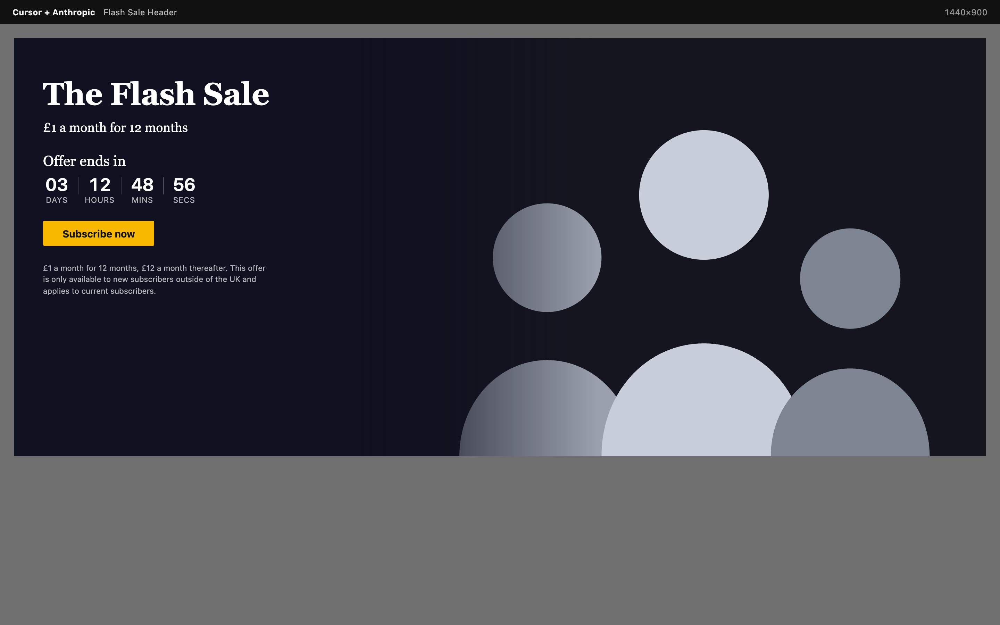
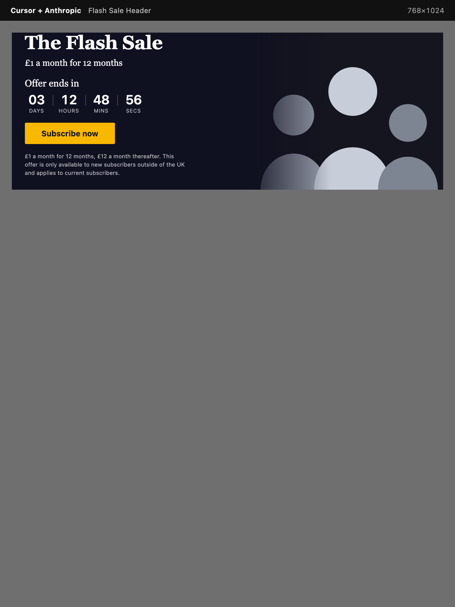
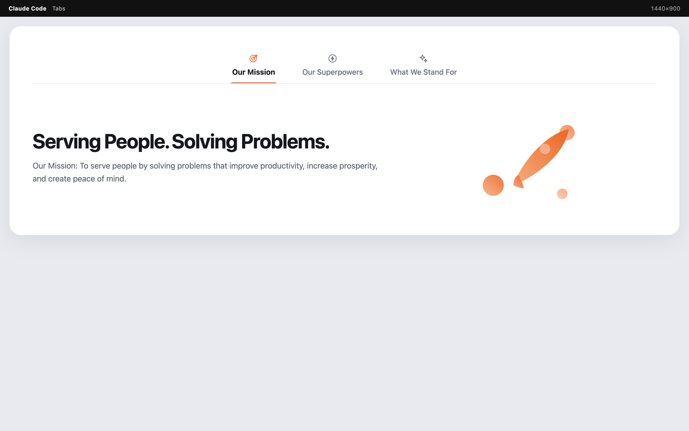
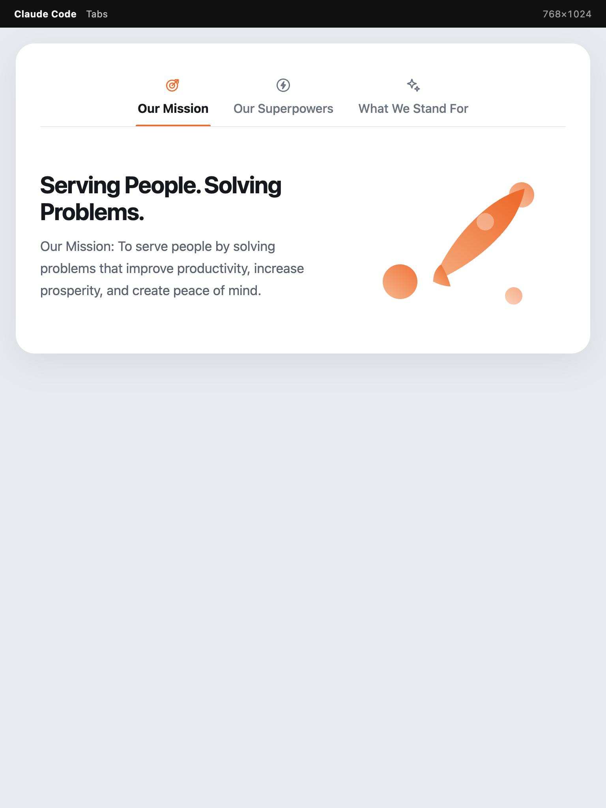
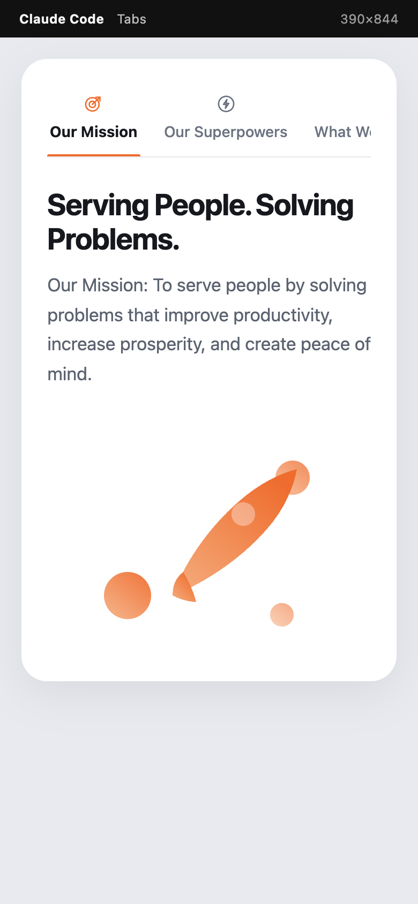
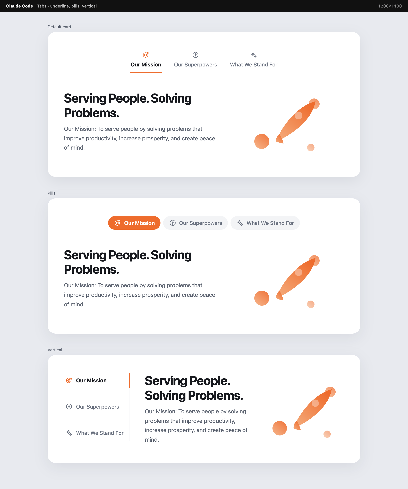
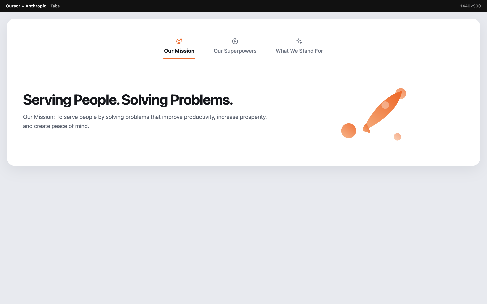
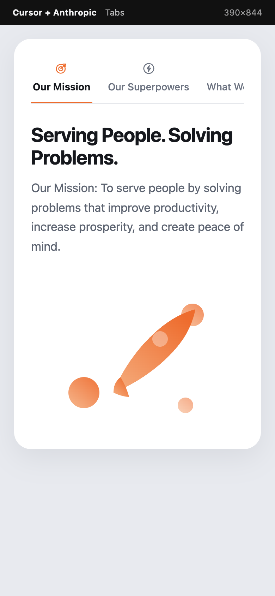

# Block research tool

Side-by-side evaluation of three AI coding tools building the **same two Gutenberg blocks** from the same brief:

1. **Flash Sale Header** (`global-store/flash-sale-header`) — countdown promo with wide / medium / tall layouts
2. **Tabs** (`global-store/tabs` + `global-store/tab`) — accessible tabs whose panels accept any inner blocks

Use this repo to judge which tool we should standardise on: time to a usable block, visual quality, and how close the output is to production WordPress standards.

## The three implementations

| Folder | Tool | What ran the session |
| --- | --- | --- |
| [`claude-code/`](claude-code/) | Claude Code | Claude Code CLI |
| [`cursor-anthropic/`](cursor-anthropic/) | Cursor + Anthropic | Cursor with an Anthropic model |
| [`cursor-auto/`](cursor-auto/) | Cursor Auto | Cursor Auto |

Each folder contains both plugins under `plugins/`.

## Development time comparison

Wall-clock hours were not stopwatch-tracked. The figures below are **reconstructed from commit dates, file timestamps, and output volume** so we can compare the three tools on the same axis. Treat them as planning estimates, not timesheets.

| | Claude Code | Cursor + Anthropic | Cursor Auto |
| --- | ---: | ---: | ---: |
| **Calendar** | 28 Aug – 3 Sep (Flash Sale first, Tabs rewritten later) | 1–3 Sep (Flash Sale then Tabs) | 4 Sep (both blocks, one commit) |
| **Estimated hands-on time** | **~7.5 hours** | **~7 hours** | **~4.5 hours** |
| Flash Sale (estimated) | ~3.5 h | ~4 h | ~2.5 h |
| Tabs (estimated) | ~4 h (first pass + rewrite) | ~3 h | ~2 h |
| **Source lines (JS + PHP + SCSS)** | 4,039 | 8,704 | 9,043 |
| Flash Sale / Tabs lines | 1,576 / 2,463 | 4,850 / 3,854 | 4,832 / 4,211 |
| **Test files** | 5 (Flash Sale only) | 18 | 19 |
| **Architecture** | Brief-faithful, flatter | Production-shaped (classes, REST, sanitisation) | Same family as Anthropic, slightly more complete |

### How to read the time numbers

- **Claude Code** got a working Flash Sale out first (28 Aug) and a first Tabs block on 31 Aug. Tabs was then rewritten on 2–3 Sep to the richer architecture, which is why its time is higher than “one session.”
- **Cursor + Anthropic** spent more of its hours on a test pyramid, REST clock-sync, and sanitisation rather than on a thinner first draft.
- **Cursor Auto** produced that same production-shaped pair in a single morning. Lowest time **and** highest completeness in this sample.

Time alone is the wrong score. The useful question is **hours per production-ready block**.

## Quality comparison (what those hours bought)

| Criterion | Claude Code | Cursor + Anthropic | Cursor Auto |
| --- | --- | --- | --- |
| Meets the written brief | Yes | Yes | Yes |
| `auto` size (container queries pick the layout) | Locked sizes only; CQ still adapt wide/medium | Yes (`auto` + 520px / 900px) | Yes (`auto` + 520px / 900px) |
| Server-rendered countdown (no CLS) | Partial (digits start at `00`) | Yes | Yes |
| Clock-skew / cache sync REST | No | Yes | Yes |
| Hide when expired, accent, image focal point | No | Yes | Yes |
| Tabs: underline / pills / vertical / icons | Yes (after rewrite) | Yes | Yes |
| Tabs: left / center / right alignment like `core/tabs` | Start / center / end | Start / center / end | Start / center / end **and** left / right aliases |
| JS + PHP unit + integration + e2e | Flash Sale only; Tabs tests removed in rewrite | Full pyramid (Tabs missing editor unit + alignment e2e) | Full pyramid including Tabs editor tests + alignment e2e |
| Standalone preview tool | Tabs only | Both | Both |

**Recommendation from this sample:** Cursor Auto is the best time-to-quality trade-off. Cursor + Anthropic is a close second on quality and took longer. Claude Code is the fastest path to a first visible block, then needs a second pass if we want the same test and security surface.

## Screenshots for the CTO demo

Every plugin folder has a `docs/` directory with the same four shots:

| File | What it shows |
| --- | --- |
| `docs/desktop.png` | 1440×900 — block filling the viewport |
| `docs/tablet.png` | 768×1024 |
| `docs/mobile.png` | 390×844 |
| `docs/layouts.png` | All locked sizes / variants on one page |

Open the PNGs directly, or serve `docs/responsive.html` / `docs/layouts.html` to click through live.

### Flash Sale Header

#### Claude Code

| Desktop | Tablet | Mobile |
| --- | --- | --- |
|  |  |  |


#### Cursor + Anthropic

| Desktop | Tablet | Mobile |
| --- | --- | --- |
|  |  |  |


#### Cursor Auto

| Desktop | Tablet | Mobile |
| --- | --- | --- |
|  |  |  |


### Tabs

#### Claude Code

| Desktop | Tablet | Mobile |
| --- | --- | --- |
|  |  |  |



#### Cursor + Anthropic

| Desktop | Tablet | Mobile |
| --- | --- | --- |
|  |  |  |


#### Cursor Auto

| Desktop | Tablet | Mobile |
| --- | --- | --- |
|  |  |  |


## Suggested evaluation scorecard

Score each tool 1–5. Weight time only after quality clears the bar.

| Question | Claude Code | Cursor + Anthropic | Cursor Auto |
| --- | --- | --- | --- |
| Time to a demo-able block | | | |
| Visual fidelity to the brief | | | |
| Responsive behaviour (desktop / tablet / mobile) | | | |
| WordPress security / escaping | | | |
| Test coverage we would keep | | | |
| Would we merge this without a rewrite? | | | |
| **Weighted total** | | | |

## Regenerating the screenshots

From the repo root (needs PHP, Node, and a Playwright-capable Chrome):

```bash
PLAYWRIGHT_BROWSERS_PATH="$HOME/Library/Caches/ms-playwright" node tools/capture-screenshots.mjs
```

That writes `docs/desktop.png`, `docs/tablet.png`, `docs/mobile.png`, and `docs/layouts.png` in each plugin folder, plus the HTML pages those shots were taken from.

## Running a plugin locally

```bash
cd cursor-auto/plugins/flash-sale-header-block   # or any other plugin folder
npm install
composer install
npm run build
npm run env:start   # WordPress at http://localhost:8888 (admin / password)
```
