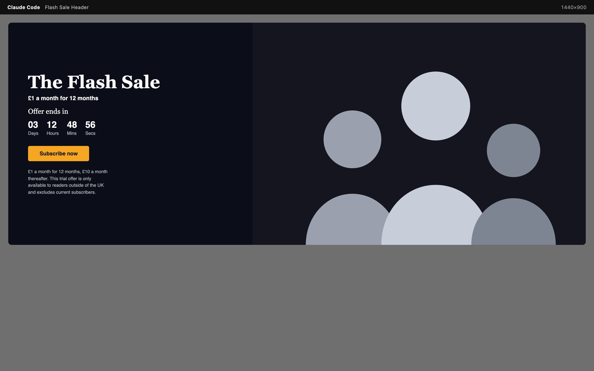
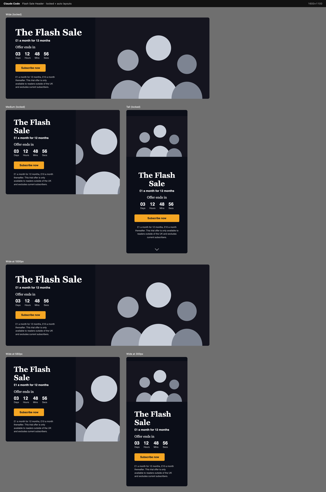

# Global Store Flash Sale Header

A dynamic Gutenberg block (`global-store/flash-sale-header`) that renders a
countdown-driven flash sale header in one of three layouts — `wide`,
`medium`, `tall` — chosen from the Inspector Controls and auto-adapted via
CSS Container Queries.

| Desktop 1440 | Tablet 768 | Mobile 390 |
| --- | --- | --- |
|  |  |  |



## Structure

```
flash-sale-header-block.php   Plugin bootstrap, registers the block from build/
src/
  block.json                  Attributes, supports, render/view script wiring
  index.js                    Registers the block type
  edit.js                     Editor UI (Inspector Controls, RichText, MediaUpload)
  save.js                     Returns null — this is a dynamic (server-rendered) block
  render.php                  Sanitized/escaped server-side markup
  view.js                     Frontend countdown hydration (viewScript)
  utils.js                    Shared getTimeRemaining() used by edit.js + view.js
  style.scss / editor.scss    Frontend and editor-only styles
tests/
  js/                         Jest + React Testing Library
  php/                        PHPUnit
  e2e/                        Playwright (@wordpress/e2e-test-utils-playwright)
    fixtures/design-reference.png   Original design brief, kept for manual comparison
```

## Setup

```bash
npm install
composer install
```

## Build

```bash
npm run build      # production build into build/
npm start          # watch mode for development
```

The plugin only registers the block once `build/block.json` exists, so run
`npm run build` (or `npm start`) before activating it in WordPress.

## Linting

```bash
npm run lint:js
npm run lint:css
composer run lint          # PHPCS (WordPress-Extra ruleset)
composer run lint:fix       # PHPCBF autofix
```

## Tests

### JavaScript (Jest / React Testing Library)

```bash
npm run test:unit
```

Covers `edit.js` (layout switching, control rendering, attribute updates)
and the shared `getTimeRemaining()` countdown math.

### PHP (PHPUnit)

Requires a WordPress test install. Either:

```bash
npm run env:start      # starts a wp-env environment with this plugin mounted
npm run test:php
```

or, without wp-env:

```bash
bin/install-wp-tests.sh <db-name> <db-user> <db-pass> localhost latest
composer install
composer run test
```

Covers block registration and `render.php` output — sanitization,
escaping, and per-layout CTA visibility.

### End-to-end (Playwright)

```bash
npm run env:start
npm run test:e2e
```

Covers inserting the block, switching between the three layout sizes, and
verifying the countdown renders on the published frontend. Also includes a
`toHaveScreenshot()` visual-regression check per layout size (baseline
images live in `tests/e2e/__screenshots__/` after the first run) so any
future change to the layout/typography is caught automatically — separate
from `tests/e2e/fixtures/design-reference.png`, the original mockup this
block was built from, which is kept for manual side-by-side comparison
since it uses stock photography this test suite doesn't have.
