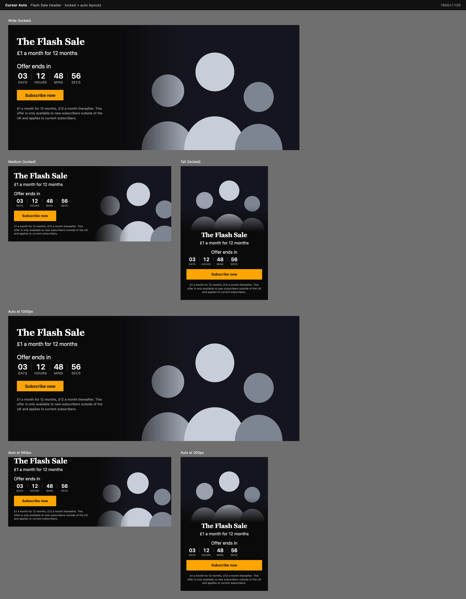
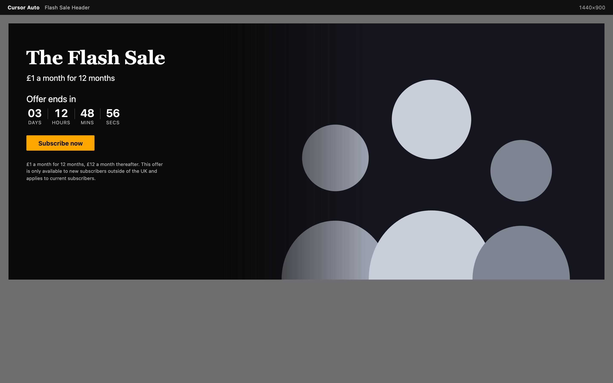

# Global Store Flash Sale Header

A secure, server-rendered Gutenberg block (`global-store/flash-sale-header`) that renders a promotional header with a live countdown, a call to action and cutout imagery. It adapts between three layouts either automatically, using CSS container queries, or by locking a size in the block sidebar.



| Desktop 1440 | Tablet 768 | Mobile 390 |
| --- | --- | --- |
|  |  |  |

## Layouts

| Size     | Composition                                                              |
| -------- | ------------------------------------------------------------------------ |
| `wide`   | Full-width header: text and countdown on the left, cutout imagery right  |
| `medium` | Card: text top-left, countdown, CTA, imagery right                       |
| `tall`   | Vertical: imagery top, text and countdown centred, CTA and legal at foot |
| `auto`   | Default. Container queries pick the layout from the block's own width    |

In `auto` mode the block declares `container-type: inline-size` on its wrapper, so the layout responds to the width of whatever column it sits in rather than to the viewport. The breakpoints are 520px and 900px of block width. Browsers without container query support fall back to viewport media queries at the same widths.

## Editable content

Everything is edited in place or from the block sidebar:

- Header title and subtitle (RichText, bold and italic only)
- Countdown label, expiry date and time (`DateTimePicker`, interpreted in the site timezone), expired message, and an option to remove the block once the offer ends
- CTA label, URL and "open in a new tab"
- Cutout image (`MediaUpload` / `MediaReplaceFlow`), its alternative text and focal position
- Fine print / legal disclaimer
- Accent colour, plus the core colour, spacing, typography and alignment supports

## Architecture

**Server rendered, lightly hydrated.** `render.php` produces the complete markup, including the countdown digits calculated on the server, so the block is correct with JavaScript disabled and there is no layout shift on load. `view.js` (2 KB minified, no framework) only keeps the digits ticking.

```
flash-sale-header-block.php        Plugin bootstrap and block registration
includes/class-attributes.php      Attribute validation and sanitisation
includes/class-renderer.php        Markup builder (pure, unit tested)
includes/class-rest-controller.php REST routes
src/flash-sale-header/             block.json, edit.js, view.js, styles, render.php
tools/preview.php                  Renders the three layouts to a static page
```

A few decisions worth knowing about:

- **Timezones.** `DateTimePicker` emits wall-clock time with no offset. The server interprets it with `wp_timezone()`, and the editor preview uses the site offset from `@wordpress/date`, so authors, editors and visitors all see the same deadline.
- **Clock skew.** The rendered HTML carries both the expiry timestamp and the server's clock. If they disagree by more than a minute — which happens on pages served from a full-page cache, or when a visitor's clock is wrong — `view.js` makes one uncached request to `/global-store/v1/flash-sale/time` before it starts counting.
- **Accessibility.** Digits changing every second would flood a screen reader, so the timer is paired with a throttled live region that announces whole minutes, and decorative cutouts (no alternative text) are hidden from assistive technology.

## Security

- Every attribute is re-validated in `Attributes::sanitize()` before it reaches the renderer, regardless of what `block.json` declared: sizes and focal positions are matched against allow-lists, colours against hex or `var(--…)` patterns, and dates against a strict pattern plus `checkdate()`.
- Output is escaped at the point of use with `esc_html()`, `esc_attr()`, `esc_url()` and `wp_kses_post()`. Rich text fields permit a small set of inline tags; every other field is plain text.
- URLs are limited to `http`, `https`, `mailto` and `tel`, so `javascript:` and `data:` values are dropped and the CTA is omitted.
- `/global-store/v1/flash-sale/validate-expiry` is editor-only: it requires a valid `wp_rest` nonce **and** the `edit_posts` capability. `/flash-sale/time` is public but returns nothing beyond the server clock and is sent with `Cache-Control: no-store`.

## Getting started

```bash
npm install
composer install
npm run build          # or: npm start, to watch
npm run env:start      # WordPress at http://localhost:8888 (admin/password)
```

## Quality checks

| Command                       | What it covers                                                     |
| ----------------------------- | ------------------------------------------------------------------ |
| `npm run test:unit`           | Jest / React Testing Library: 62 tests over `edit.js` and `view.js` |
| `npm run test:php`            | PHPUnit: 54 isolated tests over sanitisation and rendering          |
| `npm run test:e2e`            | Playwright: insertion, size switching, front-end DOM and escaping   |
| `npm run lint:js`             | ESLint with `@wordpress/eslint-plugin`                              |
| `npm run lint:css`            | Stylelint                                                          |
| `npm run lint:php`            | PHPCS with WordPress Coding Standards                               |

The PHP unit suite stubs the handful of WordPress functions it needs, so it runs anywhere PHP does. The integration suite boots a real WordPress and is run inside `wp-env`:

```bash
npm run env:start
npx wp-env run tests-cli --env-cwd=wp-content/plugins/flash-sale-header-block \
  vendor/bin/phpunit --configuration phpunit-integration.xml.dist
```

It covers block registration, attribute defaults, `render.php` output through core's `render_block()`, timezone conversion, and the REST routes' nonce and capability checks.

End-to-end tests need a built plugin and a running environment:

```bash
npm run build && npm run env:start && npm run test:e2e
```

To review the three layouts without WordPress:

```bash
npm run build && php tools/preview.php
php -S 127.0.0.1:8765 -t artifacts   # then open http://127.0.0.1:8765/preview.html
```

## Requirements

WordPress 6.5+, PHP 7.4+. Development uses Node 20+ and Composer 2.
