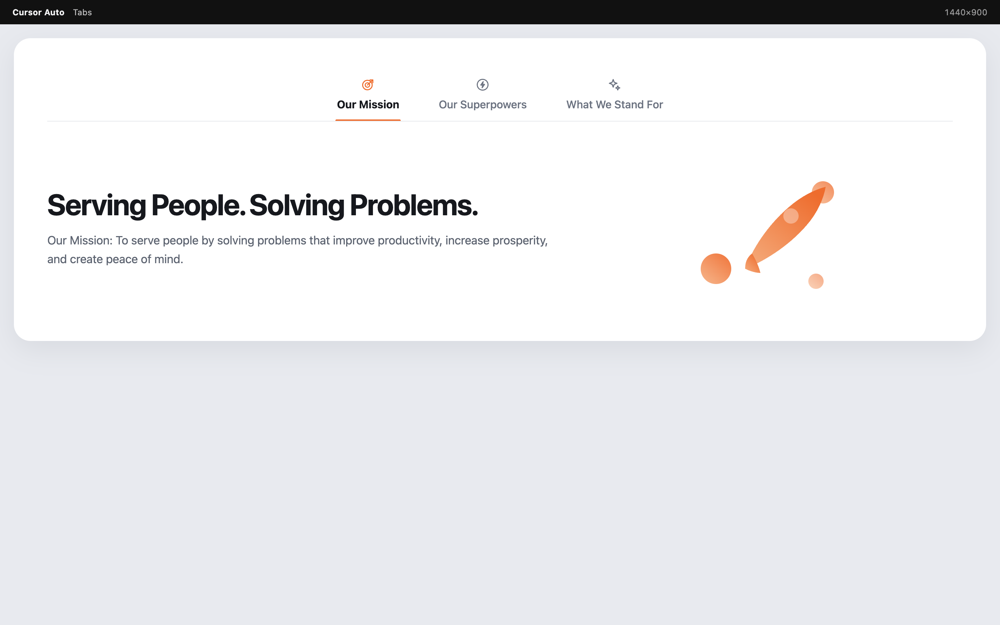
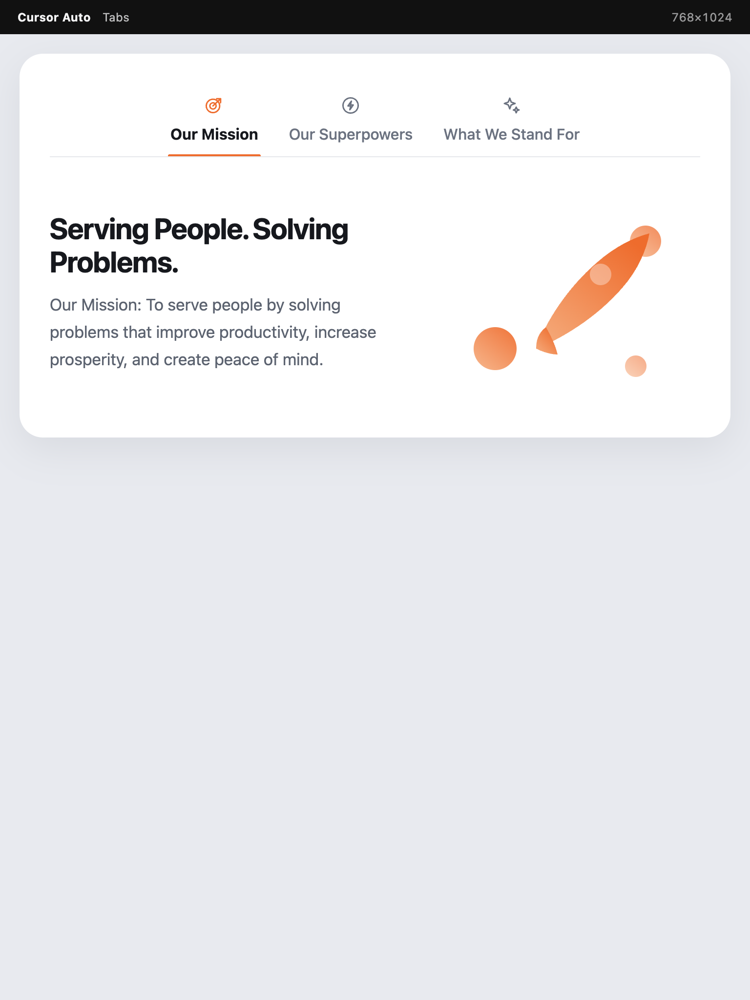
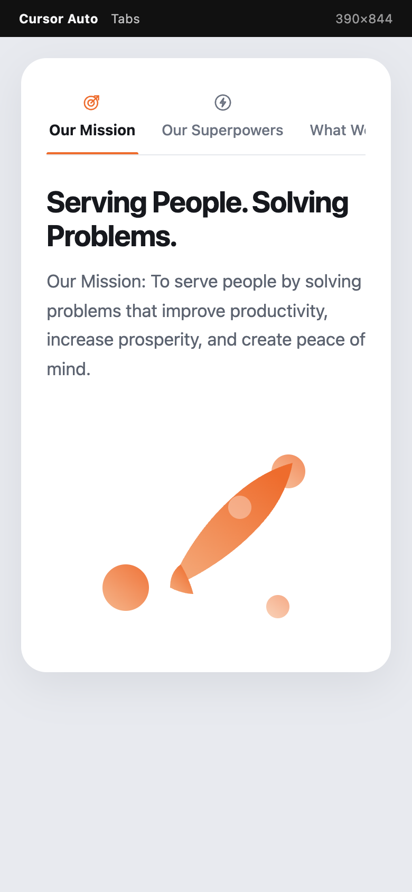
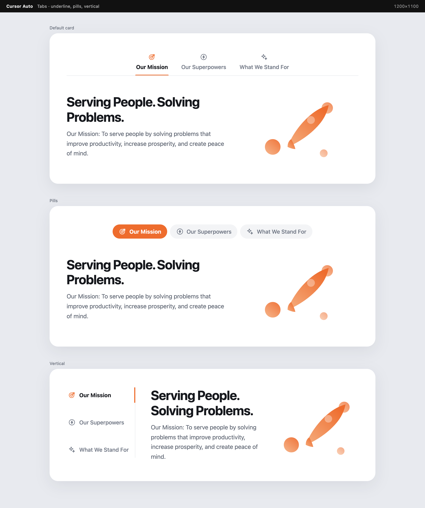

# Global Store Tabs

Accessible, server-rendered Gutenberg tabs whose panels accept any inner blocks. Tab lists can be aligned left, center or right — the same justification options as `core/tabs`.

| Desktop 1440 | Tablet 768 | Mobile 390 |
| --- | --- | --- |
|  |  |  |



## Blocks

- `global-store/tabs` — container (tab list + panels)
- `global-store/tab` — a single panel; add headings, images, columns, or any other block inside it

## Alignment

Use the block toolbar (left / center / right) or **Tab alignment** in the sidebar. Vertical lists ignore alignment. `left` and `right` stored in markup are normalised to `start` and `end`.

## Develop

```bash
npm install
composer install
npm run build
npm run test:unit
composer test
```
